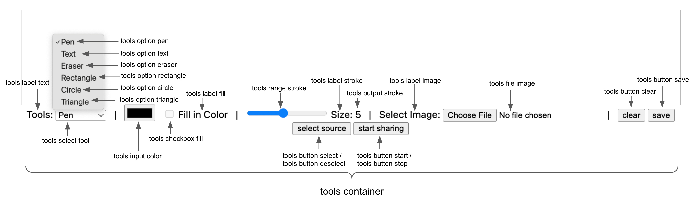

# \<white-board>

This Web Component follows the [open-wc](https://github.com/open-wc/open-wc) recommendation and is meant to be used with the [Vonage Video SDK](https://developer.vonage.com/en/video/overview).

> A [Vonage Video API account](https://dashboard.nexmo.com) will be needed.

A goal is to simplify the code needed to create a video chat quickly. This Web Component will enable whiteboard / annotation functionality.

## Installation

```bash
npm i @vonage/white-board
```

## Usage

### import from node modules

```html
<script type="module">
  import '@vonage/white-board/white-board.js';
</script>
```

### OR using a CDN
```html
<script type="module" src="https://cdn.jsdelivr.net/npm/@vonage/white-board@latest/white-board.js/+esm"></script>

```

### place tag in HTML

```html
<white-board></white-board>
```

### Attributes that can be used (optional):

- `properties` : (Object) the properties used to publish the whiteboard. Find the full list in the [documentation](https://vonage.github.io/conversation-docs/video-js-reference/latest/OT.html#initPublisher).
- `text` : (Object) set the text elements of the UI.
```javascript
// Default values
{
  tools : 'Tools:',
  pen : 'Pen',
  text : 'Text',
  eraser : 'Eraser',
  rectangle : 'Rectangle',
  circle : 'Circle',
  triangle : 'Triangle',
  fillInColor : 'fill in Color',
  size : 'Size:',
  selectImage : 'Select Image:',
  clear : 'clear',
  save : 'save',
  clearSource : 'clear source',
  selectSource : 'select source',
  startSharing: 'start sharing',
  stopSharing: 'stop sharing'
}
```

```html
<white-board text='{"pen":"Pencil"}'></white-board>
```

## Styling

The Web Component uses the [CSS pseudo-element `::part`](https://developer.mozilla.org/en-US/docs/Web/CSS/::part) for styling. So you can style it the same way you would style a regular button element. Here's an example:

```css
white-board::part(tools button) {
  font-size: 20px;
  color: white;
  background-color: black;
  border-radius: 5px;
}
```

Here is a diagram showing the different parts of the Web Component labeled.




## Getting it to work

1. Get a reference to the Web Component.
2. Generate a Session and Token.
3. Pass Session and Token into Web Component reference.

>**Note**: This can vary with library / framework (see [examples folder](../examples))

## Testing with Web Test Runner

To execute a single test run:

```bash
npm run test
```

To run the tests in interactive watch mode run:

```bash
npm run test:watch
```

## Demoing with Storybook

To run a local instance of Storybook for your component, run

```bash
npm run storybook
```

To build a production version of Storybook, run

```bash
npm run storybook:build
```


## Tooling configs

For most of the tools, the configuration is in the `package.json` to minimize the amount of files in your project.

If you customize the configuration a lot, you can consider moving them to individual files.

## Local Demo with `web-dev-server`

```bash
npm start
```

To run a local development server that serves the basic demo located in `demo/index.html`
